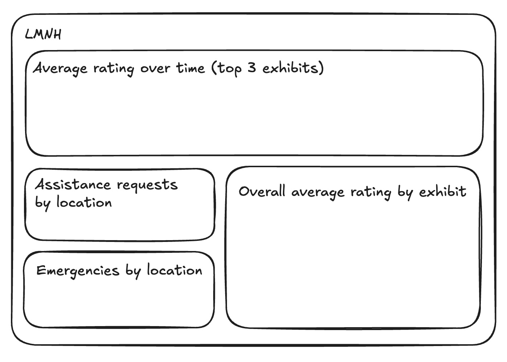

# Pipeline Installation

## Dependencies

A .env file is required to provide the credentials for connecting to AWS and the database. The following variables are required:

```
db_name=your_database_name
db_user=your_username
db_password=your_database_password
db_host=your_host_name
access_key_ID=your_aws_access_key_id
secret_access_key=your_aws_secret_access_key
bucket_name=your_aws_s3_bucket_name
download_directory=downloads
combined_csv_filename=lmnh_hist_data_all.csv
start_of_file=lmnh_hist_data
request=-1
assistance=0.0
emergency=1.0
BOOTSTRAP_SERVERS=your_kafka_bootstrap_servers
SECURITY_PROTOCOL=your_kafka_security_protocol
SASL_MECHANISM=your_kafka_sasl_mechanism
USERNAME=your_kafka_username
PASSWORD=your_kafka_password
sites=0,1,2,3,4,5
val_review=0,1,2,3,4
val_request=-1
type_request=0,1
log_file=log.txt
```


## Setting up the EC2 instance on AWS

1. Create a `terraform.tfvars` file and insert the following variables:

```
db_username = "your_database_name"
db_password = "your_database_password"
key_name    = "your_key_name"
```

2. cd to terraform directory and run `terraform init` followed by `terraform apply`.

## Setting up the database for the first time

Running schema.sql in PostgreSQL will set up the museum database:

`psql -h [host_name] -p 5432 -U [user] -d museum -f schema.sql`

## Populating the database

The database can be populated with data from either AWS S3 buckets or live data from Kafka.

### AWS S3 Data

Running `pipeline.py` with python3 will populate the AWS database with files obtained from the relevant S3 bucket. `pipeline.py` uses functions from `extract.py`.

### Live Data

Running `consumer.py` with python will populate the AWS database with live data.

## Making changes 

Change the values in the .env to apply the pipeline to a different AWS account/change bucket/files.

## Clearing the database

`bash reset_database.sh` will clear the rating_interaction and request_interaction tables.

## Visualising the data in tableau

Below is a wireframe diagram of the suggested layout of the Tableau dashboard:

